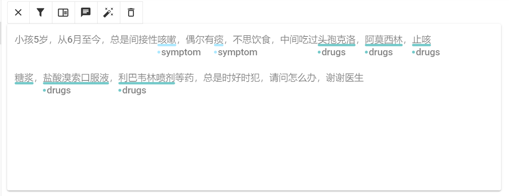

---
layout:     post
title:      算法训练平台
subtitle:   语料格式转换插件
date:       2022-11-24
co-author:     AYU
header-img: img/post-bg-2015.jpg
catalog: true
tags:
    - 算法平台
    - AutoML
    - Paas
    - 开源框架
--- 

# 2022年11月24日星期四 日志

>1. 标注语料转换插件撰写
>2. 事件提取语料梳理
>3. 模型预测插件改写【待做】

#### 1. 标注语料插件

    标注语料工具能够实现两种功能，主要面向的是人工标注数据的结果。第一种是将doccano标注平台标注数据的solr数据库存储，第二种则是符合全解析算法的训练语料格式输出。

#### 操作思想
